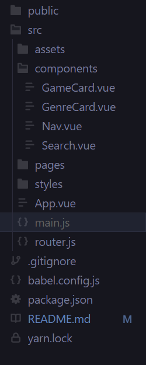

# RAWG Router (APIs with React Router) Lab

<div>
  
</div>

## Overview

We will be building a frontend website with React, React Router, and the RAWG API. We'll be getting practice with routing dynamically with `react-router-dom` elements and with making API calls with `axios` inside of React Lifecycle Methods. Try to think of this lab like a puzzle, where you'll be adding in the pieces we need to create a functioning game website.

- https://rawg.io/apidocs, a must have API for gamers!
- The endpoints (URL strings) we will be using with this API have been provided below. Starter code and component files have also been provided.

## Retrieving An Api Key

Head over to this link [Here](https://rawg.io/apidocs) to get your own api key. You'll want to add this api key to a `.env` and add the `.env` file to your `.gitignore`

### Endpoints

```js
[GET] Search `https://api.rawg.io/api/games?search={searchQuery}&key=YourApiKey`
[GET] Genres `https://api.rawg.io/api/genres?key=YourApiKey`
[GET] Game Details `https://api.rawg.io/api/games/{gameId}?key=YourApiKey`
[GET] DLC `https://api.rawg.io/api/games/{gameId}/game-series?key=YourApiKey` (Bonus)
```

## Getting Started

- `Fork` and `clone` this repository
- `npm i` to install dependencies

### App Architecture

Let's take a look at the structure of the app we've just cloned. You've been provided with all of the components you'll need to complete this exercise.

<p align="center" >
  
</p>

**Note: The app will show an error until `Step 2` is complete.**

## Step 1: Setting Up Vue Router

Let's start with `main.js`, followed by `App.vue`. In `main.js` we'll need a couple of additional imports:

```js
import VueRouter from 'vue-router'
import router from './router'
```

- We then need to add `VueRouter` as plugin
- Provide the `router` to our Vue instance.

**Note: The router has already been wired for you, however you have to write your own routes in the `router.js` file.**

```js
Vue.use(VueRouter)
new Vue({
  render: h => h(App),
  router
}).$mount('#app')
```

## Step 2: Setting Up Routes

Head over to `router.js`. In here, we've scaffolded Vue Router for you:

```js
import VueRouter from 'vue-router'
import Home from './pages/Home'
import GameDetails from './pages/GameDetails'
import ViewGames from './pages/ViewGames'
import About from './pages/About'

const routes = []

export default new VueRouter({ routes, mode: 'history' })
```

You'll need to create your own routes and add them to the `routes` array utilizing the following table:

| Component   | Path              | Name          |
| ----------- | ----------------- | ------------- |
| Home        | /                 | 'Home'        |
| ViewGames   | /games            | 'ViewGames'   |
| GameDetails | /details/:game_id | 'GameDetails' |
| About       | /about            | 'About'       |

## Step 3: Setting Up The Router View

In `App.vue`, you're provided with the following:

```jsx
<template>
  <div id="app">
    <header>
      <!-- Nav Goes Here -->
    </header>
    <main>
      <!-- Router View Goes Here -->
    </main>
  </div>
</template>

<script>
export default {
  name: 'App',
  components: {}
}
</script>
```

- You'll want to utilize the `Nav` component and add it between the provided `header` tags. **Remember to import the nav component and add it to your `components` object.**
- Don't forget to use the `router-view` component as this is where our components will get rendered. You can add it in between the provided `main` tags.

## Step 4: Loading Initial Data

In `Home.vue`, you've been provided with a few methods and some initial state, in this component, you should fire an axios request that retrieves a list of genres in the `getGenres` method. This method should be invoked once the component is mounted and should update the genre state.

- Once you've retrieved a list of genres from your api, iterate through the genre state and return a `GenreCard` for each item.
- The `GenreCard` should accept the image and name of each genre as props. You'll need to wire these up in the `GenreCard` component following the included prompts.

## Step 5: Setting Up Search Functionality

In `Home.vue` set up a form within the provided `search` classed tag. It should be displayed above the provided `h2`. This form should have an input and a button.

- The value of the input should be `searchQuery`
- `handlChange` should be used to update the `searchQuery` state
- The `@submit` event should fire the `getSearchResults` method which in turn should update the `searchResults` array.
- The `searched` state should be updated to `true` once the results are retrieved. If the the state is true, conditionally render the provided `div` with class of `genres` to be hidden. **The `!` operator may be useful here.**

## Step 6: Listing The Search Results

Now that we have the search results in state, you'll want to bring in the `GameCard` component in `Home.vue`. You should return a new card for each item in the `searchResults` array.

- You'll need to import the `GameCard` component
- Pass the name and image of the game as props.
- Display these props in the noted sections within `GameCard`.
- Don't forget to declare which props it will be recieving.

## Step 7: Viewing Game Details
